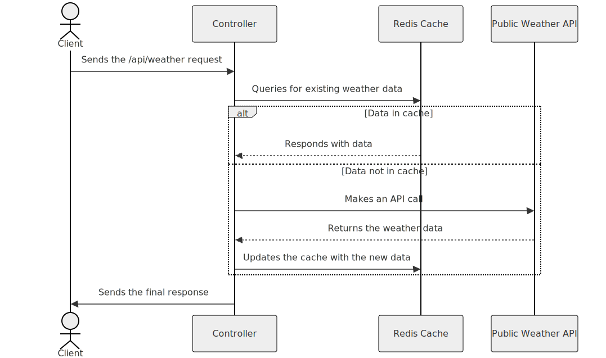

# Weather Predictor Backend

This is the backend service for the Weather Prediction application, built using **Spring Boot**. The service provides weather forecasts for a city and exposes APIs for clients to interact with. Swagger is used for API documentation to ensure clarity for consumers.

---

## Features

- Fetch weather data for a given city.
- Caching mechanism to reduce API calls to the external weather provider.
- Centralized error handling with clear error codes.
- API documentation using Swagger UI.
- Scalable and modular code structure.

---

## Design and Implementation

### Architecture

The backend is designed with a clean separation of concerns:

- **Controller Layer**: Handles HTTP requests and responses.
- **Service Layer**: Encapsulates business logic.

### Key Highlights

1. **Spring Boot** is used for rapid application development and integration with other technologies.
2. **Swagger** is configured for documenting and testing APIs.
3. **Exception Handling**: Centralized exception handler to map errors to meaningful HTTP responses and error codes.
4. **Cache Implementation**: Uses Redis caching to minimize external API calls.
5. **Scalable Design**: Built with modularity to support additional features.

---

## API Documentation

### Swagger UI

Swagger is integrated into the backend to provide interactive API documentation.

- **Access the Swagger UI**: `http://<host>:<port>/swagger-ui/`
- **Explore API Endpoints**: Detailed API documentation with input parameters and responses.

### Example Endpoints

| HTTP Method | Endpoint       | Description            |
| ----------- | -------------- | ---------------------- |
| GET         | `/api/weather` | Get weather for a city |

---

## Sequence Diagram

Below is the sequence of events when a user makes an API call to fetch weather data.



## Design Patterns Used

| **Pattern**                 | **Component(s)**                                                                                                        |
| --------------------------- | ----------------------------------------------------------------------------------------------------------------------- |
| **Proxy Pattern**           | `WeatherCacheManagerImpl` for managing Redis interactions and external API calls.                                       |
| **Strategy Pattern**        | Interfaces such as `WeatherService`, `WeatherCacheManager`, and `WeatherApiClient` to define interchangeable behaviors. |
| **Decorator Pattern**       | `WeatherServiceImpl` enhances functionality by adding caching to `WeatherApiClientImpl`.                                |
| **Template Method Pattern** | `GlobalExceptionHandler` to standardize exception handling logic across the application.                                |

Steps:

1. **Client** sends a weather request to the backend.
2. **Controller** validates the request and passes it to the service layer.
3. **Service Layer** checks the cache for the requested data.
   - If found: Returns cached data.
   - If not: Calls the external weather provider API.
4. Response is returned to the **Client**.

## How to Run

### Prerequisites

- **Java 17+**
- **Maven**

### Steps

1. Clone the repository:
   ```bash
   git clone https://github.com/kunseal/weatherpredictor-backend.git
   cd weatherpredictor-backend
   ```
2. Build the project:
   ```bash
   mvn clean install
   ```
3. Run the application:
   ```bash
   mvn spring-boot:run
   ```
4. Access the application:
   ```
    API Base URL: http://localhost:8080
    Swagger UI: http://localhost:8080/swagger-ui/
   ```
